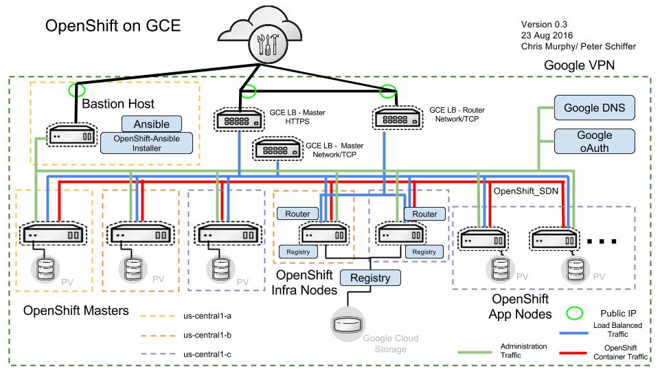

# CASL Google cloud provider setup instructions

The following instruction will deploy an architecture close to the one in the picture. The main differences are that there is no bastion host and that also nodes are spread across network zones.



## Google Cloud Platform preparation

### Create an account

Sign up for google cloud. It can be done [here](https://console.cloud.google.com/freetrial).

### Create a project

Create a gcp project.
The project id (not name) will be hencefort referred to as `$gcp_project`.
All the below actions must be executed in the content of this project.

### Consider requesting additional quota

Initial quota for a google cloud project may not allow you to install an HA OpenShift cluster (at least last time I checked).
Conside requesting additional quotas [here](https://console.cloud.google.com/iam-admin/quotas). Click on the edit quota button. 
Keep in mind that this process can take a few days.

### Configure DNS domain

You need to own a DNS domain. Instructions here apply if you choose to buy a domain with [Google Domains](https://domains.google.com).
Choose a DNS domain, henceforth referred to as `$dns_domain`.
Create a dns domain zone in google cloud that reflects that domain by going [here](https://console.cloud.google.com/net-services/dns/zones)
The first record of the zone will be a NS record. It will contain 4 dns servers. 
To my understanding, although that field is editable, you have to use the servers that are assigned to you.
Copy those server in the dns domain configuration of your domain registrar. 
The propagation of this information to the entire internet may take hours.
To watch progress, you can create an A record with `a-name` in you zone and then issue this command from you laptop:
```
watch nslookup <a-name>.$dns_domain
```
wait until that starts resolving.    

### Configure SSH keys

Upload your ssh key for connecting to the vm by going [here](https://console.cloud.google.com/compute/metadata).
You also have to define a user for this key. We will refer to this user henceforth as `$gcp_user`.

### Configure the gcp service account

Create a service account by going [here](https://console.cloud.google.com/iam-admin/serviceaccounts).
Your service account should have the `editor` role.
Download the json file to a secure location. We will refer to that loaction as `$gcp_sa_json`.
Take note of the service account id (it will look like an email address). We will refer to it as `$gcp_sa_id`.

## Ansible host preparation

Install the following software:

```
yum install ansible python-libcloud
```

>Note: Red Hat Enterprise Linux does not provide the `pip` command outside of Software Collection Libraries (SCL).
>For other distributions, the command `pip install apache-libcloud` may be used. Packages installed using `pip`
>within SCL may require additional configuration of Ansible to use the SCL environment.

To install the GCP CLI (`gcloud`), follow these [instructions](https://cloud.google.com/sdk/downloads#yum).

### Configure the casl-environment

Clone the ansible repo (you may also want to use a specific verison) and install the necessary galaxy repo.
```
git clone https://github.com/redhat-cop/casl-ansible
cd casl-ansible
ansible-galaxy install -r casl-requirements.yml -p galaxy
```

### Configure gcp dynamic inventory

Refer to this link on all the options for configuring gcp dynamic invetory to the [offical doc](http://docs.ansible.com/ansible/latest/guide_gce.html).
Also refer to the provided example [inventory](../inventory/sample.gcp.example.com.d/inventory).
The minimum that you have to do is to have the `gce.py` script and the `gce.ini` config in you inventory root.
In `gce.ini` edit the following configuration:
```
gce_service_account_email_address = $gcp_sa_id
gce_service_account_pem_file_path = $gcp_sa_json
gce_project_id = $gcp_project
```

To test that dynamic inventory is working run the following from your inventory directory:
```
./gce.py --list
```

## Inventory configuration

### Mandatory gcp-related properties

Refere to the example [inventory](../inventory/sample.gcp.example.com.d/inventory).
The following casl specific configuration must be provided in the all.yaml
```
ansible_user: $gcp_user
ansible_become: true
hosting_infrastructure: gcp
dns_domain: $dns_domain
env_id: <a unique identifier for that gcp project>

casl_instances:
   region: <gcp region>
   masters: 
     count: <# of masters>
     zones: 
     - <zone 1>
     - <zone 2>
     - ...
     name_prefix: <prefix of master VM names> 
   appnodes: 
     <similar to above>
   infranodes: 
     <similar to above>
     
service_account_email: $gcp_sa_id
credentials_file: $gcp_sa_json
project_id: $gcp_project

#openshift_master_cluster_public_hostname must be something like <prefix>.{{ env_id }}.{{ dns_domain }}
openshift_master_cluster_public_hostname: <master-external>.{{ env_id }}.{{ dns_domain }}
#openshift_master_cluster_hostname must be something like <prefix>.{{ env_id }}.{{ dns_domain }}
openshift_master_cluster_hostname: <master-internal>.{{ env_id }}.{{ dns_domain }}
#openshift_master_default_subdomain must be something like <prefix>.{{ env_id }}.{{ dns_domain }}
openshift_master_default_subdomain: <apps>.{{ env_id }}.{{ dns_domain }}
```

The format of the VM names will be `<prefix>-<ordinal>-<env_id>`.     

Notice that we bring the `openshift_master_cluster_public_hostname`, `openshift_master_cluster_hostname`, `openshift_master_default_subdomain` from the OSEv3 group (vars) to the all group (vars). You must not redefine those properties in the OSEv3 group. 
Also you must not specify the `docker_storage_block_device`.

Ad the other standard casl properties in the all.yaml group_vars, and anything OpenShift related properties to the OSEv3 group_vars definition.

For the host layout see the example and replace the suffixes with your `env_id`.

### All gcp related properties

| variable  | optional  | default  | description  |
|:-:|:-:|:-:|:-:|
| ansible_user  | no  |  | the user to connect with with ssh, must be `$gcp_user`  |
| ansible_become  | no  | `false` | must be set to `true`  |
| hosting_infrastructure  | no  |  | must be set to `gcp`  |
| dns_domain  | no  |  | the domain you want to use for this cluster, must be `$dns_domain`  |
| env_id | no |  | a unique cluster identifier for this gcp project | 
| casl_instances.region | no |  | the gcp region in which to install the cluster |
| casl_instances.image_name | yes | `rhel7` | image to use for all the VMs |
| casl_instances.masters.count | no |  | number of masters |
| casl_instances.masters.flavor | yes | `n1-standard-2` | type of VM |
| casl_instances.masters.zones | no |  | array of availability zones in which the masters will be equally spread |
| casl_instances.masters.name_prefix | yes | `master` | prefix of the master VM names |
| casl_instances.masters.preemptible  | yes  | `false`  | whether should be preemptible, not recommeded.  |
| casl_instances.masters.docker_volume_size  | yes  | `10`  | size of the docker volume disk  |
| casl_instances.appnodes.count | no |  | number of appnodes |
| casl_instances.appnodes.flavor | yes | `n1-standard-2` | type of VM |
| casl_instances.appnodes.zones | no |  | array of availability zones in which the appnodes will be equally spread |
| casl_instances.appnodes.name_prefix | yes | `node` | prefix of the appnode VM names |
| casl_instances.appnodes.preemptible  | yes  | `false`  | whether should be preemptible, not recommeded.  |
| casl_instances.appnodes.docker_volume_size  | yes  | `50`  | size of the docker volume disk  |
| casl_instances.inranodes.count | no |  | number of inranodes |
| casl_instances.inranodes.flavor | yes | `n1-standard-2` | type of VM |
| casl_instances.inranodes.zones | no |  | array of availability zones in which the inranodes will be equally spread |
| casl_instances.inranodes.name_prefix | yes | `inranodes` | prefix of the inranode VM names |
| casl_instances.inranodes.preemptible  | yes  | `false`  | whether should be preemptible, not recommeded.  |
| casl_instances.inranodes.docker_volume_size  | yes  | `20`  | size of the docker volume disk  |
| service_account_email | no |  | service account to be used when connecting to the Google API |
| credentials_file  | no  |  | path to the credential file in json format to be used for the connections to the Google  |
| project_id  | no  | `20` | gcp project id to use  |
| openshift_master_cluster_public_hostname | no |  | recommeded `<a name>.{{ env_id }}.{{ dns_domain }}` |
| openshift_master_cluster_hostname  | no  |  | recommeded `<a name>.{{ env_id }}.{{ dns_domain }} ` |
| openshift_master_default_subdomain  | no  |  | recommeded `*.<a name>.{{ env_id }}.{{ dns_domain }}`  |

## Running the playbook. 

In order to run the playbook run the following:
```
ansible-playbook -i <inventory_dir> --private-key=<private key for $gcp_user> <casl_ansible_dir>/playbooks/openshift/end-to-end.yml
```

## Running the playbook from the openshift-ansible container
You can run the gcp install directly from the openshift-ansible container.
Checkout the version of casl that you want to use and run the galaxy command:
```
git clone https://github.com/redhat-cop/casl-ansible
cd casl-ansible
ansible-galaxy install -r casl-requirements.yml -p roles
```
at this point you can run the playbook this way:
```
docker run -t -u `id -u` -v <gcp keyfile.json location>:<gcp keyfile.json location>:Z,ro \
                         -v <ssh keyfile>:/opt/app-root/src/.ssh/id_rsa:Z,ro \
                         -v <your inventory>:/tmp/inventory:Z,ro \
                         -v <casl_dir>:/tmp/casl-ansible:Z,ro \
                         -e INVENTORY_DIR=/tmp/inventory \
                         -e PLAYBOOK_FILE=/tmp/casl-ansible/playbooks/openshift/end-to-end.yml \
                         openshift/origin-ansible:<your version>
```                        

## Configuring the registry to use gcp object storage
The end-to-end playbook will configure the regsitry to use the gcp object storage.
If you need to execute this operation separately, you can run the following command:
```
ansible-playbook -i <inventory_dir> --private-key=<private key for $gcp_user> <casl_ansible_dir>/playbooks/openshift/gcp/configure-registry.yml
```


# Cleaning up
In order to clean up run this plyabook
```
ansible-playbook -i <inventory_dir> --private-key=<private key for $gcp_user> <casl_ansible_dir>/playbooks/openshift/delete-cluster.yaml
```


